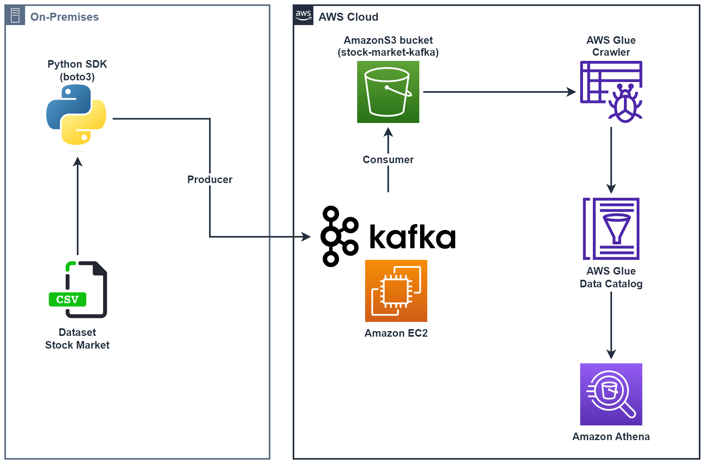

# Real-Time Stock Market Analysis Kafka 📈

This End-To-End Data Engineering project focused on analyzing real-time stock market data using Kafka. The project utilizes various technologies including Python, Amazon Web Services (AWS), Apache Kafka, Glue, Athena, and SQL to process and analyze the data.

## Architecture

<div align="center">



</div>

[Tutorial reference](https://www.youtube.com/watch?v=KerNf0NANM)

```shell
chmod 400 stock-market-kafka.pem
ssh -i ".ssh/stock-market-kafka.pem" ec2-user@ec2-3-86-226-189.compute-1.amazonaws.com
```

```shell
# Install kafka 3.3.1
wget https://archive.apache.org/dist/kafka/3.3.1/kafka_2.12-3.3.1.tgz
tar -xf kafka_2.12-3.3.1.tgz

# Install java 8
sudo yum install java-1.8.0-openjdk
java -version
```

```shell
# Change advertised.listeners to EC2's public IPv4 address
sudo nano config/server.properties
```

```shell
cd kafka_2.12-3.3.1
bin/zookeeper-server-start.sh config/zookeeper.properties
export KAFKA_HEAP_OPTS="-Xmx256M -Xms128M" && bin/kafka-server-start.sh config/server.properties
```

```shell
# Create topic
bin/kafka-topics.sh --bootstrap-server 3.86.226.189:9092 --create --topic sample_topic --replication-factor 1 --partitions 1
# Delete topic
bin/kafka-topics.sh --bootstrap-server 3.86.226.189:9092 --delete --topic sample_topic
# List topics
bin/kafka-topics.sh --bootstrap-server 3.86.226.189:9092 --list
```

```shell
# Start producer
bin/kafka-console-producer.sh --bootstrap-server 3.86.226.189:9092 --topic sample_topic
# Start consumer
bin/kafka-console-consumer.sh --bootstrap-server 3.86.226.189:9092 --topic sample_topic --from-beginning
```
